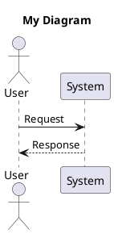
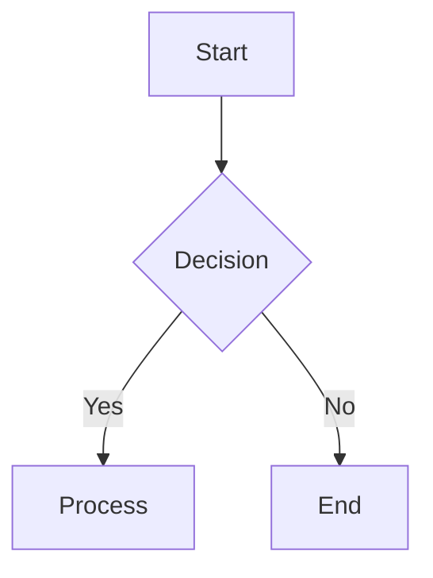
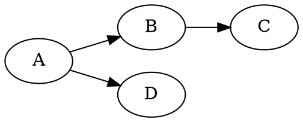

# Diagram & Advanced Syntax Reference

## PlantUML

````markdown

````

**Activity color syntax:** `#color:activity;` or `<<#color>>`

Example:
```
:Process Payment;
#lightgreen:Verify Card;
:Generate Receipt;
```

## Mermaid

````markdown

````

Use `flowchart` over `graph`. Use `["text"]` for spaces in node labels.

## Graphviz (DOT)

````markdown

````

## LaTeX Math

Inline: `$E = mc^2$`

Display:
```math
$$
\int_{-\infty}^{\infty} e^{-x^2} dx = \sqrt{\pi}
$$
```

## GFM Tables

```markdown
| Left | Center | Right |
|:-----|:------:|------:|
| a    |   b    |     c |
```
